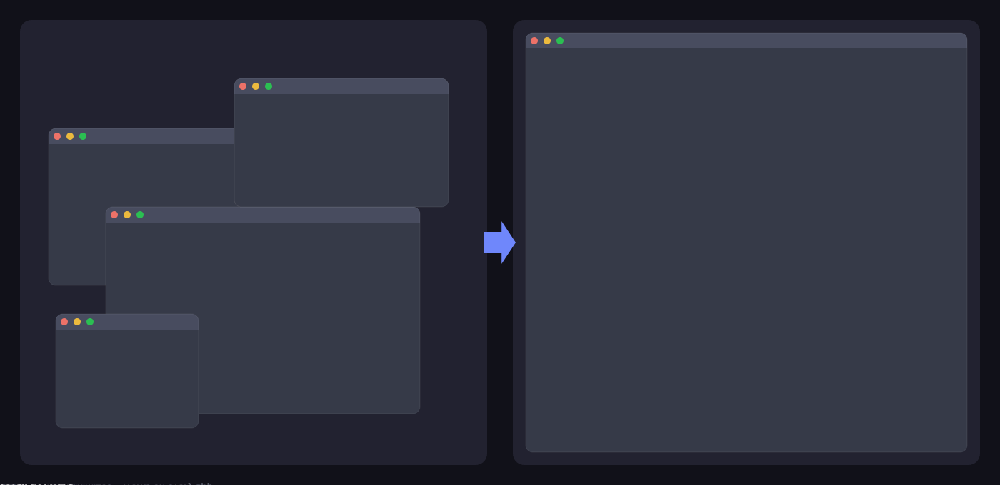

# Maximize

**Restore the old macOS window behavior** — where the green zoom button *maximizes* a window instead of throwing it into fullscreen mode.



## What it does

- **On launch** — maximizes every open window to fill its screen's visible area (no fullscreen mode, just a large regular window)
- **Green zoom button** — intercepts the click and maximizes the window instead of triggering macOS fullscreen
- **Multi-monitor aware** — each window fills the screen it's already on
- **Runs silently** — lives in the menu bar, no dock icon

## Install

```bash
git clone https://github.com/mohamedsamir0331/maximize.git
cd maximize
bash build.sh
```

> **Requires:** macOS 13+, Xcode Command Line Tools (`xcode-select --install`)

On first launch, macOS will prompt for **Accessibility permission** (System Settings → Privacy & Security → Accessibility). Grant it and the app starts working immediately — no restart needed.

## Usage

| Action | Result |
|--------|--------|
| Click green zoom button | Maximizes that window |
| Click green button again (already max) | Lets macOS handle it normally |
| Menu bar → Maximize All Now | Maximizes every open window |
| Menu bar → Launch at Login | Toggles auto-start on boot |

## How it works

Maximize uses the macOS **Accessibility API** to resize windows and a **CGEvent tap** to intercept zoom button clicks before the system processes them. When you click the green button, it suppresses the click and instead resizes the window to the screen's `visibleFrame` (the area not covered by the menu bar or Dock).

## License

MIT
